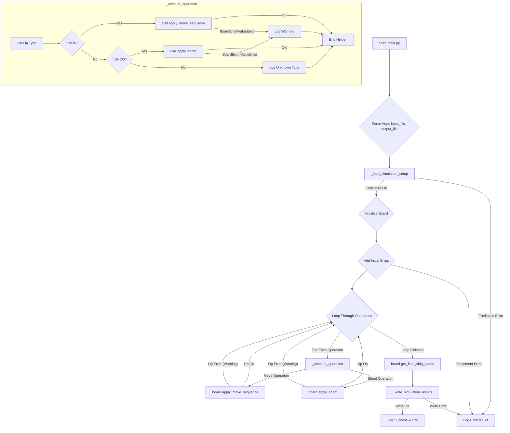

# Battleship Simulator

This project implements a simple command-line battleship simulation based on a given input file.

## Features

- Simulates ship placement, movement (rotate left, rotate right, move forward), and shooting on a square board.
- Parses a specific input file format for board setup and operations.
- Outputs the final state of all ships (position, orientation, sunk status) to a specified file.
- Includes unit tests for core components.
- Provides logging for tracing simulation steps.

## Project Structure

```plaintext
.
├── battleship/      # Source code package
│   ├── __init__.py
│   ├── models.py    # Data classes (Position, Ship) and Enums (Orientation, OperationType, MoveCommand)
│   ├── game.py      # Board class implementing game logic (placement, movement, shooting)
│   └── parser.py    # Functions for parsing the input file
├── tests/           # Unit tests
│   ├── __init__.py
│   ├── test_models.py
│   ├── test_game.py
│   └── test_parser.py
├── main.py          # Main executable script
├── input.txt        # Example input file
├── output.txt       # Example output file (generated)
└── README.md        # You're here 🎯
```

## Input File Format

The input file (`input.txt` by default) defines the simulation parameters:

1. **Line 1:** An integer `N` representing the size of the square board (NxN). The bottom-left cell is (0, 0).
2. **Line 2:** A space-separated list of initial ship positions and orientations. Each ship is defined as `(x, y, O)`, where `x` and `y` are integer coordinates and `O` is the orientation (N, E, S, W - case-insensitive). Example: `(0, 0, N) (9, 2, E)`
3. **Subsequent Lines:** Operations to perform, one per line.
   - **Move Operation:** `(x, y) S`, where `(x, y)` are the coordinates of the ship to move, and `S` is a sequence of characters (case-insensitive):
     - `L`: Rotate ship 90 degrees left (counter-clockwise).
     - `R`: Rotate ship 90 degrees right (clockwise).
     - `M`: Move ship one step forward in its current orientation.
       Example: `(0, 0) MRMLMM`
   - **Shoot Operation:** `(x, y)`, where `(x, y)` are the coordinates to shoot at.
     Example: `(9, 2)`

_Empty lines are ignored._

## Output File Format

The output file (`output.txt` by default) contains the final state of each ship, one per line, in the _same order_ they were defined in the input file.

- Format: `(x, y, O)` for ships that are still afloat.
- Format: `(x, y, O) SUNK` for ships that have been sunk.

Example:

```plaintext
(1, 3, N)
(9, 2, E) SUNK
```

## Usage

This project uses [Poetry](https://python-poetry.org/) for dependency management and running scripts within a virtual environment.

Place your input files (like `input.txt`) inside the `input/` directory.
Output files will be generated inside the `output/` directory.

1. **Install Dependencies:**
   (If you haven't already, navigate to the project root directory)

   ```bash
   poetry install
   ```

   _This installs runtime dependencies and development dependencies like `pytest`._

2. **Run Simulation:**

   Provide just the filename for the input and output files. The script handles the directories.

   - Example with `input.txt` generating `output.txt`:

     ```bash
     poetry run python main.py input.txt output.txt
     ```

3. **Run Tests:**

   ```bash
   poetry run pytest
   ```

## Game Loop / Logic Flow

The main script orchestrates the simulation as follows:



Key logic points:

- Movement simulation (`_simulate_move` within `board.apply_move_sequence`) checks boundaries step-by-step.
- Collisions are only checked based on the _final_ position of a move sequence. Ships can move _through_ occupied cells.
- Sunk ships cannot move.
- Shooting an already sunk ship or an empty cell has no effect.
- Shooting out of bounds is ignored.
- Errors during individual operations (move/shoot) are logged as warnings, and the simulation continues. Critical errors (file not found, parsing errors, initial placement errors) cause the program to exit.
